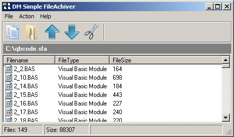



## DM Simple FileAchiver v1\.0

### Description

DM Simple FileAchiver v1.0

DM Simple FileAchiver, is a simple file achiver I made for an easy way of keeping files I needed for a game,

in a simple way, makeing is also easy to update the grx and other resources.

DM Simple FileAchiver, allows you to Add, Extract, Delete and Open files

You can also create a build a self extracting exe, to give to other people. All code is commeted, main packing code is in the two class files. so if you do not use the program, you can still find some usfull code for using listview, dealing with files and other things, that may help with your own projects, Hope you like it.
 
### More Info
 

             |
---                |---
**Submitted On**   |2008-03-26 10:54:36
**By**             |[dreamvb](https://github.com/Planet-Source-Code/PSCIndex/blob/master/ByAuthor/dreamvb.md)
**Level**          |Intermediate
**User Rating**    |5.0 (10 globes from 2 users)
**Compatibility**  |VB 5\.0, VB 6\.0
**Category**       |[Files/ File Controls/ Input/ Output](https://github.com/Planet-Source-Code/PSCIndex/blob/master/ByCategory/files-file-controls-input-output__1-3.md)
**World**          |[Visual Basic](https://github.com/Planet-Source-Code/PSCIndex/blob/master/ByWorld/visual-basic.md)
**Archive File**   |[DM\_Simple\_2107473262008\.zip](https://github.com/Planet-Source-Code/dreamvb-dm-simple-fileachiver-v1-0__1-70328/archive/master.zip)

